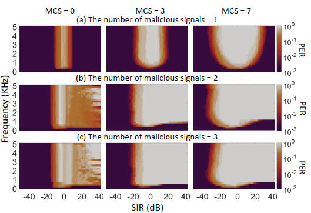
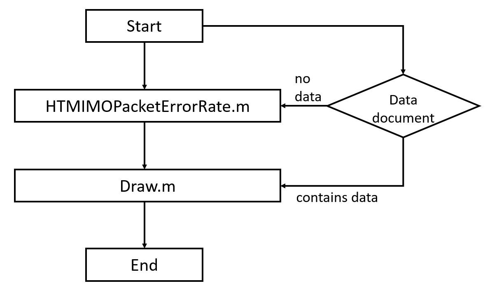

# Attack Simulation

## Introduction

Attack Simulation is a MATLAB documentation,Simulate the PER of OFDM signal decoding using different modulation and coding schemes (MCS = 0, 3, 7) when 1, 2, and 3 malicious frequency shifted signals are superimposed respectively.

Our simulations are conducted using the MATLAB WLAN Toolbox . The foundational simulation parameters of the Wi-Fi system are set to the IEEE 802.11n wireless standard with HT Mixed mode, employing a 40 MHz bandwidth, 2x2 MIMO channels, 30 SNR, and Channel Model-D. 

To assess the impact of the frequency-shifted malicious signal, we observe the packet error rate (PER) as a key metric for evaluating communication quality.

## Instructions for use

- **HTMIMOPacketErrorRate script: HTMIMOPacketErrorRate.m**

  Description: We superimposed different frequency-shifted signals and introduced the concept of signal-to-interference ratio (SIR) for simulation based on the example given in the official MATLAB article '[802.11n Packet Error Rate Simulation for 2x2 TGn Channel](https://www.mathworks.com/help/wlan/ug/802-11n-packet-error-rate-simulation-for-2x2-tgn-channel.html)'.

  By modifying the MCS (0, 3, 7) and superimposing the number of malicious frequency-shifted signals (1, 2, 3), the packet error rate (PER) of OFDM signal decoding under different signal-to-interference ratios (SIR) is calculated and the data is saved.

  SIR represents the power ratio between the original legitimate Wi-Fi signal and the frequency-shifted malicious signal. A zero SIR means equal power, a positive SIR means the malicious signal is stronger, and a negative SIR means the legitimate signal is stronger.

- **Function: htNoiseEstimate.m**

  Description: htNoiseEstimate.m is used to estimate noise power using HT data field pilots.
  
  ```matlab
  function [nest,sigest] = htNoiseEstimate(x,chanEst,cfgHT,varargin)
  % 'htNoiseEstimate.m' is used in the following example:
  %  802.11n Packet Error Rate Simulation for 2x2 TGn Channel,
  %  htNoiseEstimate.m' is a function written by Matlab. We just call it during simulation.
  ```
  
- **Draw script: Draw .m**

  Description: Plot the SIR and PER data generated by HTMIMOPacketErrorRate.m.

- **Function: GenColormap.m**

  Description: GenColormap.m is used to build colorbar color map to help draw images.
  
  ```matlab
  function colormap = GenColormap(map, n)
  % GenColormap Generate a colormap with a specified number of colors.
  %
  % Inputs:
  %   map - The original colormap as an m×3 matrix, where m is the number of colors
  %         and 3 represents the RGB channels.
  %   n   - The desired number of colors in the output colormap. Defaults to 256.
  %
  % Outputs:
  %   colormap - An n×3 matrix representing the generated colormap, where each row
  %              corresponds to an RGB color value.
  ```

- **Data document: MaliciousSignals_1, MaliciousSignals_2, MaliciousSignals_3**

  Description: Because HTMIMOPacketErrorRate.m processes a large amount of data simultaneously, the operation is time-consuming. The data document primarily stores the PER values calculated by HTMIMOPacketErrorRate.m.
  
  The number at the end of each file name indicates the count of superimposed malicious frequency-shifted signals. Each MaliciousSignals
file contains three data sets corresponding to the PER data for MCS levels (0, 3, 7).

## Additional Notes

The default save address of HTMIMOPacketErrorRate.m data is the current directory folder, which can be changed by the user according to the needs.

Draw.m data loading defaults to any group in the Data document.

**Simulation results display:(Data stored in the data document)**



**Flow chart:**


