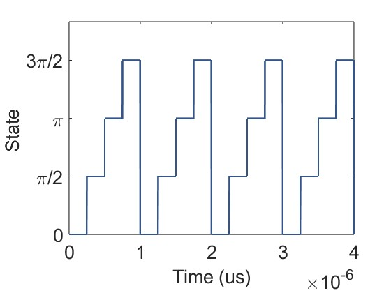

# Harmonic Generation

## Introduction

Harmonic generation is a MATLAB documentation,It is mainly a principle simulation of harmonic generation.

## Instructions for use

- **Harmonic script: Harmonic .m**

  Description: The code mainly involves three parts, (1) incident signal  (2) state transition sequence (3) harmonic generation

## Additional Notes

  **incident signal :** 

 **state transition sequence :** 

  **harmonic generation**: 

