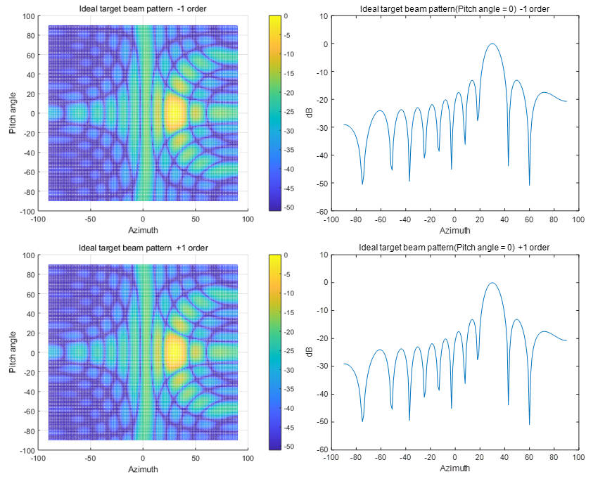

# CreateOrder

## Introduction

CreateOrder is a MATLAB documentation,It is used to calculate the compensation phase required by RIS and the corresponding beamforming pattern under ideal conditions when a given beamforming target (azimuth angle, pitch angle) is given. We can use this code to determine the compensation phase of -1, +1 order harmonics in different attack directions.

This project aims to save the compensation phase required for different beamforming directions of RIS in an offline manner in advance to facilitate subsequent search and calculation, and at the same time draw the corresponding ideal direction diagram.

## Instructions for use

- **Main script: main.m**

  Description: main.m is the main script of the project, responsible for determining the beamforming compensation phase of RIS in a given direction, and the corresponding direction pattern.

  The script performs the following operations:

  Parameter setting: Transmitter and receiver parameter settings, beam corresponding parameters, RIS parameters.
  
  Calculation: Call the two functions Idealphase.m and Idealpattern.m mentioned below to calculate the compensation phase and draw the pattern.
  
  Save results: Save the compensation phases to a file.
  
- **Function: Idealphase.m**

  Description: Idealphase.m is used to calculate the phase difference between the feed source transmission beam and the target beam.
  
  ```matlab
  function[P,u] =Idealphase(lambda0,lambda1,theta1,phi1)
  % Input parameters:
  %   lambda0 - Incident signal wavelength
  %   lambda1 - Reflection wavelength
  %   theta1  - Target beam azimuth
  %   phi1    - Target beam elevation angle
  % Output parameters:
  %   P - Ideal target phase
  %   u - Ideal compensation phase   
  ```
- **Function: Idealpattern.m**

  Description: Idealpattern.m is used to draw the pattern.
  
  ```matlab
  function Idealpattern(lambda0,lambda1,A,P)
  % Input parameters:
  %   lambda0 - Incident signal wavelength
  %   lambda1 - Reflection wavelength
  %   A       - Reflection Amplitude
  %   P       - Reflection Phase
  ```
## Additional Notes

When the parameters remain unchanged, the beamforming compensation phase is the same. Therefore, we can download the required compensation phases at various angles offline in advance to save subsequent calculation time.

Results are shown, taking the target azimuth angle of 30° and pitch angle of 0° as an example.




