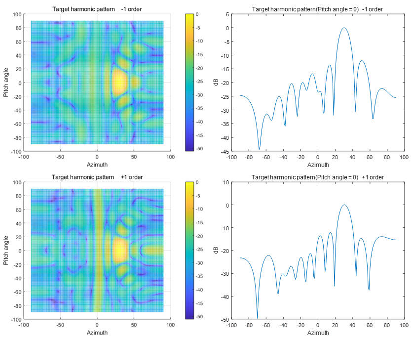

# Draw

## Introduction

Draw is a MATLAB documentation,use the FindCode document to find the saved -1 and +1 harmonic amplitudes and phases to draw the corresponding direction pattern.

This project aims to draw -1 and +1 harmonic directional diagrams based on the data obtained by FindCode, and verify whether the RIS state transition sequence table found meets expectations.

## Instructions for use

- **Main script: main.m**

  Description: main.m is the main script of the project, which is responsible for setting the main parameters and calling the Harmonicpattern.m function to draw the harmonic pattern.

  The script performs the following operations:

  Parameter settings: Transmitter parameter settings, beam corresponding parameters, RIS parameters.
  
  Data load: Load the amplitude and phase of -1 and +1 harmonics saved by FindCode.
  
  Draw harmonic patterns: calling the Harmonicpattern.m function to draw the harmonic pattern.
  
- **Function: Harmonicpattern.m**
  
  Description: Harmonicpattern.m is used to Draw -1, +1 order harmonic target pattern.
  
  ```matlab
  function Harmonicpattern(lambda0,lambda1,A,P)
  % Input parameters:
  %   lambda0 - Incident signal wavelength
  %   lambda1 - Reflection wavelength
  %   A       - Harmonic Amplitude
  %   P       - Harmonic compensation phase
  ```

## Additional Notes

Results are shown, taking the target azimuth angle of 30° and pitch angle of 0° as an example


